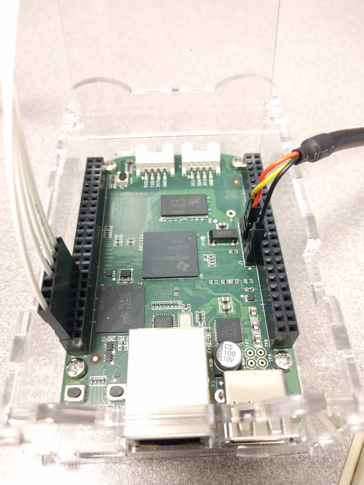

# jtag_eval
Code related to evaluating JTAG based fault injection.

This repo currently has instructions on how to perform a manual fault injection on a Zybo board using a Beaglebone running OpenOCD to perform the jtag injection.

For the Zybo board, Digilent has a good tutorial on setting up Xilinx tools and loading your first bit file / program: https://reference.digilentinc.com/learn/programmable-logic/tutorials/zybo-getting-started-with-zynq/start

## Dependencies

* `arm-none-eabi-gcc`
* `xsdb` - This comes with Xilinx Vivado
* Xilinx Vivado - Needed to build everything from scratch like the `.bit` file. Alternatively, you can use the files provided here (but you still need to install `xsdb`)
* more?

## Basic BSP (Board Support Package)
This board support package is for using the 0th ARM core of the Zynq-70X0 chip on the Zybo board.

To  build:

* Edit `setup.sh` to add the directory with `arm-none-eabi-gcc` to `PATH`
* `source setup.sh`
* `cd basic_bsp`
* `make`

## Fib Rec
This is an example program that calculates a number in the fibonacci sequence twice and compare the results (should be the same, unless data corruption occurs...). Outputs results to a serial port.

To build:
* Requires Basic BSP (see above)
* `cd fib_rec/Debug`
* `make`

The output file `Attemp2.elf` can be loaded onto the Zybo and executed.

## Running Fib_Rec on the Zybo
This runs a baremetal `.elf` on the Zybo. Also requires a `.bit` to program the FPGA even if you are not using the FPGA.

On the Zybo:
* Check JP7 jumper matches power setup (set to USB if USB powered (not barrel jack connection))
* Check that JP5 is set to JTAG
* Connect USB port (near on / off switch) to computer
* Switch power on

On Laptop:
* Navigate to directory `xsdb/instr.xsdb`
* Modify `instr.xsdb` to have the correct directories for the `.bit`, `.elf`, and `ps7_init.tcl` files. Normally only the `.elf` file will change.
* `instr.xsdb` contains the commands that `xsdb` will run. The same commands may be entered manually.
* `xsdb instr.xsdb` - This will connect to the Zybo over the USB connection, load the `.bit` file for the FPGA, run an initialization `tcl` script, and load the `.elf` file for the ARM cores.
* In `xsdb`, the command `targets` will show detected devices (should show the FPGA, and two ARM cores)
* In another terminal, runt `minicom -D /dev/ttyUSB1` to see output from the running computer.
* If you want to use the JTAG connection from the BeagleBone, exit `xsdb.`

## Injecting a Fault
Follow the instructions above to launch the fibonacci program on the Zybo.

Setup the Beaglebone.
* Connect the JTAG cable (5 pin, white wires). The Zybo connection is by the VGA port; connect with the 3v3 labled pin in the empty socket and GND, TCK, TDO, TDI, and TMS all connected. On the Beaglebone, the male connector will connect to P8, pins 2, 8, 10, 12, 14 (defined in `bbb.cfg`). See picture.
* If desired, connect the serial cable to the Beaglebone. If using a four wire connector, DO NOT CONNECT THE POWER WIRE. J1 pin 1 (index 1) is ground, RX and TX are 4 and 5 (check labels, orange on pin 4, yellow on pin 4 for the three wire connector). See picture.
* Connect USB to host laptop (will power on Beaglebone)
* Connect to Beaglebone via usb (ssh to 192.168.X.X) or serial: `minicom -D \dev\ttyUSB0` and set hardware flow control off (`ctrl-a o` for menu)
* Navigate to `jtag_eval/OpenOCD` directory (may need to clone the repo)
* `sudo openocd openocd.cfg`
* Beaglebone is now running a telnet host for OpenOCD. Can connect from the Beaglebone with `telnet localhost 4444`. Should also be usable for by `GDB` and from remote connections.

## Benchmark Code

The benchmark code from other research groups may not be available to release.

Tambara - Same build process as Fib_Rec.

Chielle - Have not yet attempted to compile. Assembly.
