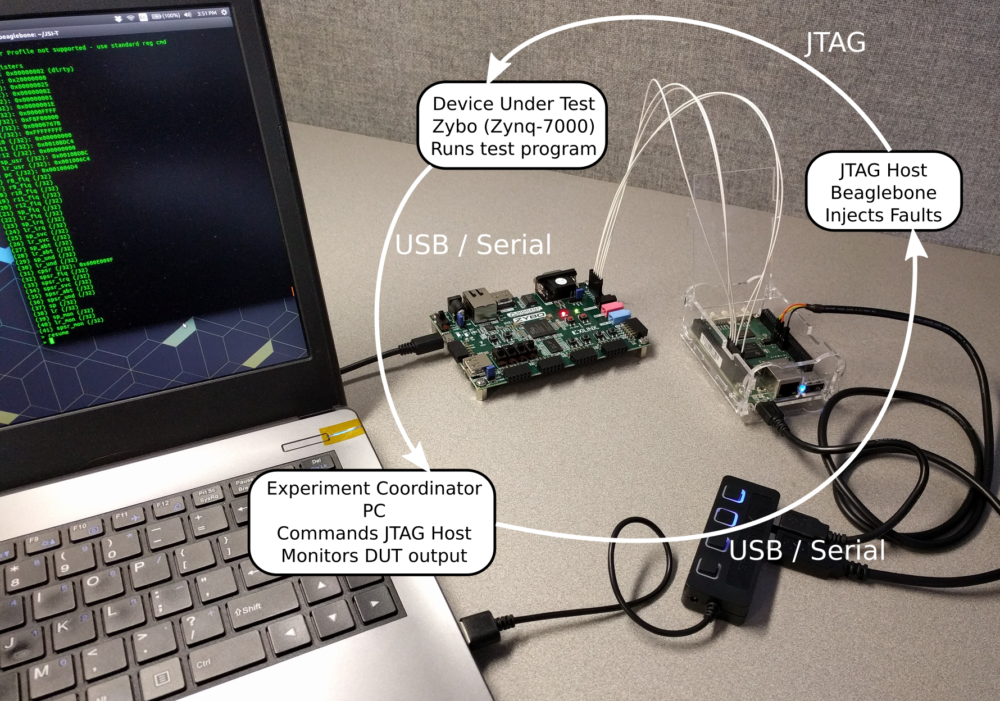
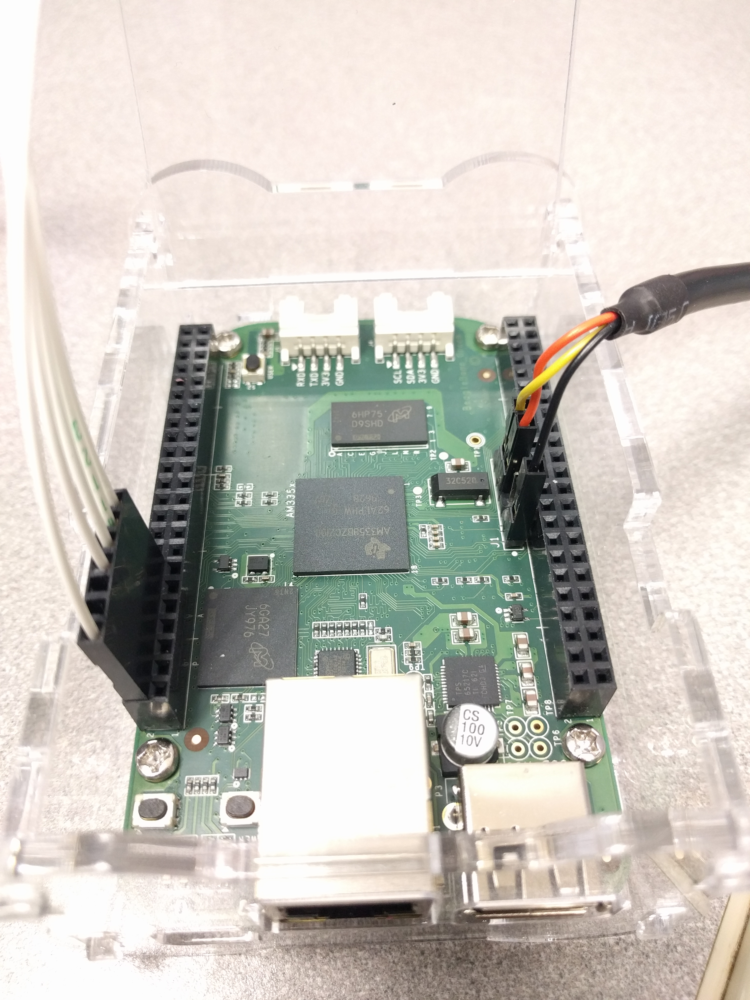

# Single Board Computer

This software was originally developed to use a BeagleBoneBlack or RaspberryPi3 as the JTAG debugger device. While this worked well for a while, both are much slower than a dedicated device such as the Digilent HS2. The BeagleBoneBlack was restricted to using the sysfsgpio driver instead of a dedicated driver (because there is not a dedicated driver). The RaspberryPi3 is about twice as fast and uses the bcm2835gpio driver.

The RaspberryPi3 maxed out at about 300 - 400 Khz. The Digilent HS2 has a max speed of 30 Mhz (although performance gains appear to drop of after about 12 Mhz).

These instructions show how to setup the Pi to use in place of a regular JTAG debugger.

## RaspberryPi 3 Configuration

There is a driver for using OpenOCD with the Raspberry Pi: bcm2835gpio. Use the sysfsgpio drive for use with any board that doesn't have a specific driver.

To set up a Pi to use as the OpenOCD device:
* Format an SD card with a Raspbian release - Used Etcher to format a 16G card with Raspbian Lite.
* Add a file named `ssh` on the boot partition - Sets the Pi to enable ssh for the next boot.
* Plug Pi into USB and Ethernet on host computer (share wired connection) - Used a laptop with Ubuntu 16.04.
* Connect with ssh - `ssh pi@raspberrypi.local`, password is `raspberry`
* pi> sudo raspi-config - turn on ssh (5 -> P2), change password as desired (1) (used `temppwd!`, must be "strong" to avoid warnings), update hostname to avoid conflicts with other raspberry pi's on the network (hostname.local will need to be updated in config files / code).
* pi> sudo apt-get update
* pi> sudo apt-get git libtool autotools-dev automake telnet python-pip bison flex
* pi> sudo pip install parse
* pi> git clone https://git.code.sf.net/p/openocd/code openocd-code
* pi> cd openocd-code; ./bootstrap; ./configure --enable-sysfsgpio --enable-bcm2835gpio  --enable-ftdi; make; sudo make install; cd ../
* pi> git clone https://github.com/jcmarsh/jtag_eval.git - will change in the future
* pi> cd jtag_eval;
* pi> mkdir openOCD_cfg/mnt
* ssh-copy-id pi@hostname.local

## Configuration (TODO)

Setup the BeagleBone.
* Connect the JTAG cable (5 pin, white wires). The Zybo connection is by the VGA port; connect with the 3v3 labled pin in the empty socket and GND, TCK, TDO, TDI, and TMS all connected. On the Beaglebone, the male connector will connect to P8, pins 2, 8, 10, 12, 14 (defined in `bbb.cfg`). See picture.
* If desired, connect the serial cable to the Beaglebone. If using a four wire connector, DO NOT CONNECT THE POWER WIRE. J1 pin 1 (index 1) is ground, RX and TX are 4 and 5 (check labels, orange on pin 4, yellow on pin 4 for the three wire connector). See picture.
* Connect USB to host laptop (will power on Beaglebone)
* Connect to Beaglebone via usb (ssh to 192.168.X.X) or serial: `minicom -D \dev\ttyUSB0` and set hardware flow control off (`ctrl-a o` for menu)
* Navigate to `jtag_eval/openOCD_cfg` directory (may need to clone the repo)
* `sudo openocd openocd.cfg`
* Beaglebone is now running a telnet host for OpenOCD. Can connect from the Beaglebone with `telnet localhost 4444`. Should also be usable for by `GDB` and from remote connections.

